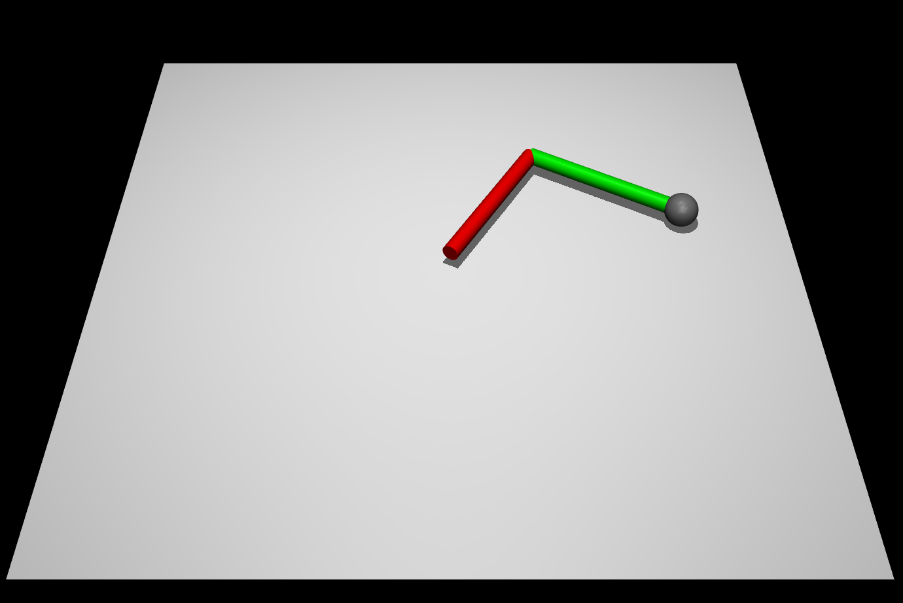
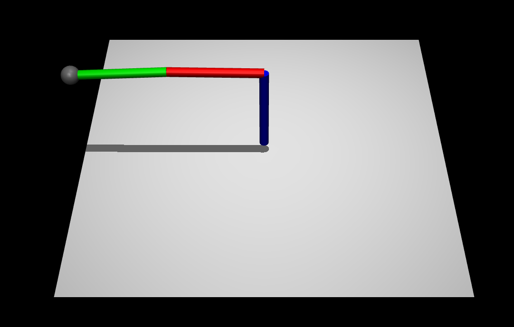
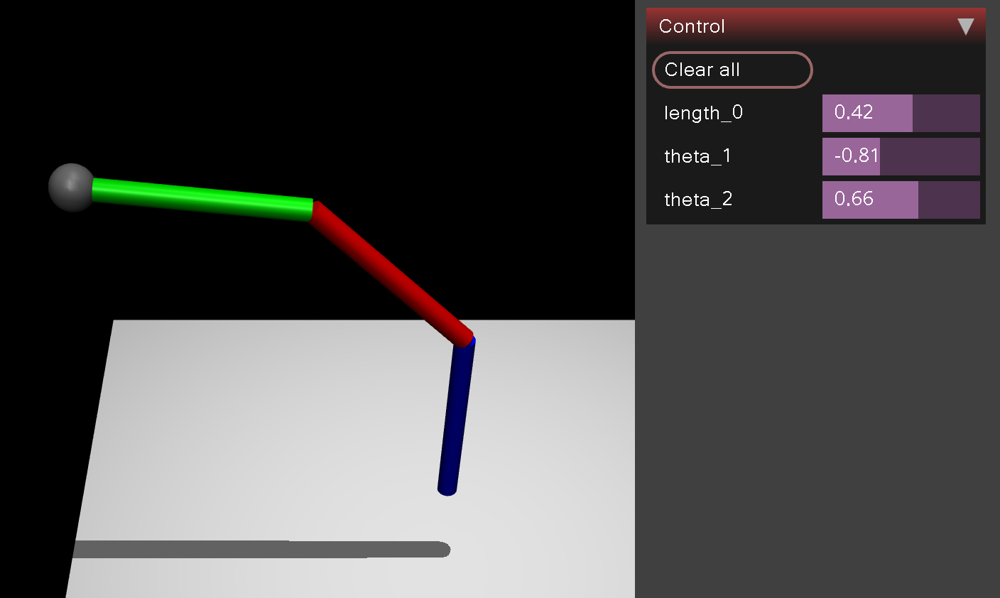

# Inverse kinematics

<script type="text/javascript"
src="https://cdnjs.cloudflare.com/ajax/libs/mathjax/2.7.3/MathJax.js?config=TeX-AMS-MML_HTMLorMML">
</script>

In this class we will:
1. implement inverse kinematics for a 2-link robot arm.
2. compute the Jacobian of the robot tip and use it to implement inverse kinematics.
3. implement inverse kinematics for a 3-link robot arm.
4. calculate on paper forward kinematics for a modified 3-link robot arm.

## Part 1: Inverse kinematics for a 2-link robot arm

The `manipulator.xml` file contains a 2-link robot arm. The robot arm is controlled by two joints. The first joint is fixed to the world and the second joint is fixed to the first link. The robot arm is shown in the figure below.



Our goal in this part is to implement inverse kinematics for the robot arm.
Inverse kinematics is the problem of finding the joint angles that will place an end effector at a desired position and orientation.
In our case the end effector (the robot tip) is a point and does not have an orientation.
Hence we will focus only on position.

### Subtask 1:

Draw the robot arm on paper and calculate the forward kinematics of the robot arm. The forward kinematics of the robot arm is the function that maps the joint angles to the position of the robot tip.

Subtask 2:

In the `2d_manipulator_ik.py` file, we have already implemented the main loop of inverse kinematics.
It uses the `mujoco.mj_jac` function for computing the Jacobian of the robot tip, i.e. a matrix that maps the joint velocities to the velocity of the tip.
In our case it is a 2x2 matrix.
To get the relation between the velocities we have to look at its columns: the first describes the velocity in the x direction and the second in the y direction.
The Jacobian of the robot tip is computed using the following code:

```python
jacp = np.zeros((3, 2))  # 3 is for x,y,z and 2 is for theta1 and theta2
mujoco.mj_jac(model, data, jacp, None, position_Q, 2)

J = jacp[[0, 1], :]
```

Use the calculated values of the Jacobian to implement inverse kinematics for the robot arm.
You may find this resources helpful:

- https://medium.com/unity3danimation/overview-of-jacobian-ik-a33939639ab2 (non-free, short and easy to understand)
- https://nrsyed.com/2017/12/10/inverse-kinematics-using-the-jacobian-inverse-part-1/ (free and pretty short)
- https://www.youtube.com/watch?v=-e7muqC3670 (for those who like videos)
- https://www.rosroboticslearning.com/jacobian (long, but free)
- https://mathweb.ucsd.edu/~sbuss/ResearchWeb/ikmethods/iksurvey.pdf (really long, but free and mathematically great)

If you have implemented inverse kinematics correctly, you should see the robot tip move to the desired position.
For your convenience the script draws small balls along the tip trajectory, as shown in the figure below.


## Part 2: Computing the Jacobian of the robot tip

Instead of using the `mujoco.mj_jac` function for computing the Jacobian of the robot tip, write a function that computes the Jacobian of the robot tip. The function should take as input the joint angles and return the Jacobian of the robot tip.

Chceck that the Jacobian computed by your function is almost (up to some small epsilon) the same as the Jacobian computed by the `mujoco.mj_jac` function.

## Part 3: Inverse kinematics for a 3-link robot arm

The `manipulator3d.xml` file contains a 3-link robot arm. The robot arm is controlled by three joints. The first joint is fixed to the world and the second joint is fixed to the first link. The third joint is fixed to the second link. The robot arm is shown in the figure below.



We recommend starting with the following stub code, since at the beginning the robot arm will be in a configuration where there is singularity in the Jacobian.

```python
def start_sim():
    global model, data, viewer_window, renderer

    xml_path = "lab13-secret/manipulator3d.xml"
    model = mujoco.MjModel.from_xml_path(xml_path)
    renderer = mujoco.Renderer(model, height=480, width=640)
    data = mujoco.MjData(model)
    mujoco.mj_step(model, data)
    viewer_window = mujoco.viewer.launch_passive(model, data)
    data.ctrl[0] = -0.2
    data.ctrl[1] = 0.2  # .00001
    data.ctrl[2] = 0.2
    for _ in range(100):
        mujoco.mj_step(model, data)
        renderer.update_scene(data)
        viewer_window.sync()
```

Write a function, that moves the robot to any desired and achievable position. For instance if the desired position is [0, -1.0, 1.1], the robot arm should move to the position shown as in the movie below.

<video width="512" height="208" controls>
  <source src="video.mp4" type="video/mp4">
  Your browser does not support the video tag.
</video>

You can use the following code to move the robot arm to a desired position.

```python
def go_to(qpos):
    data.ctrl = qpos
    for i in range(10):
        mujoco.mj_step(model, data)
        renderer.update_scene(data)
        viewer_window.sync()
        if np.linalg.norm(data.qpos - qpos) < 0.0001:
            break
        

# Example usage:

dX = target - position_Q
dq = Jinv.dot(dX)
go_to(data.qpos + 0.1 * dq)
```

Please note, that this time we control positions of the joints, not the velocities of the joints.

## Part 4: Forward kinematics for a modified 3-link robot arm

The `manipulator3d.xml` file contains a 3-link robot arm. The robot arm is controlled by three revolute joints. 
Change the first joint (`t1`) to be a prismatic joint (`slide`` in MuJoCo) and write the forward kinematics of the robot arm.

Check if the calculated forward kinematics matches the forward kinematics of the robot arm in simulation.

It's ok if your arm will float in the air, as shown in the figure below.

