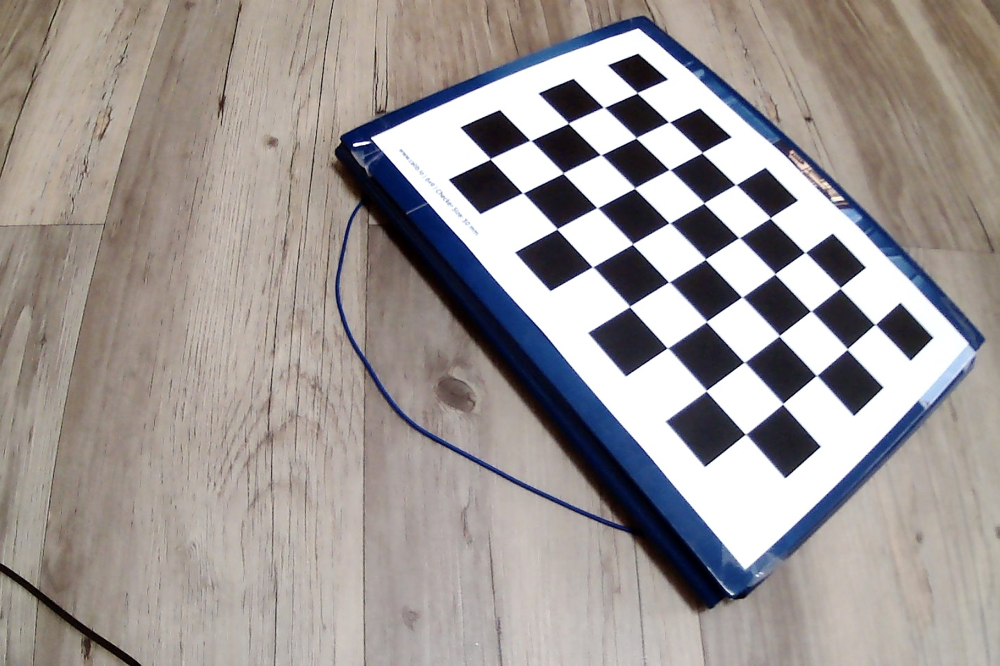
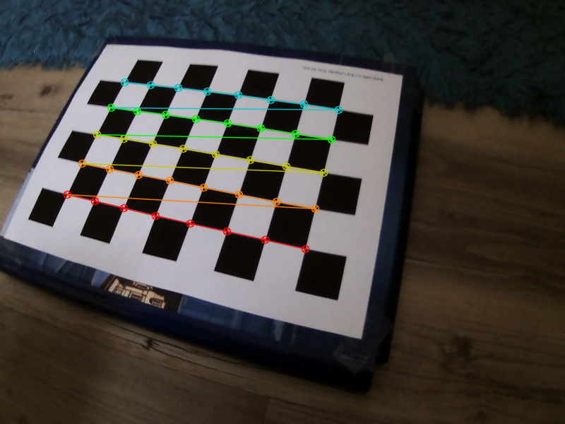
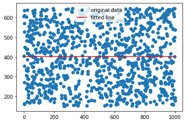
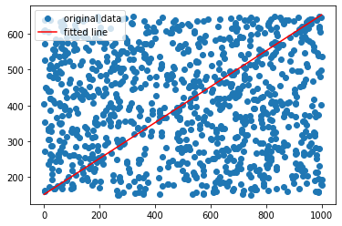
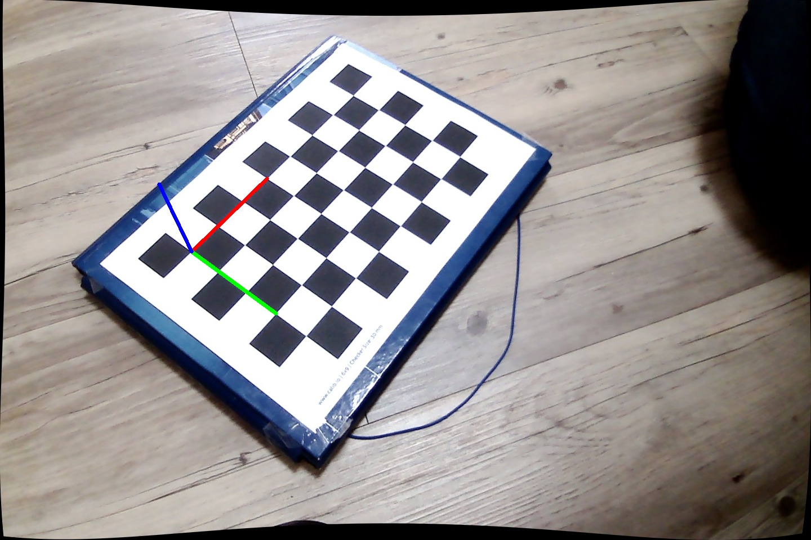
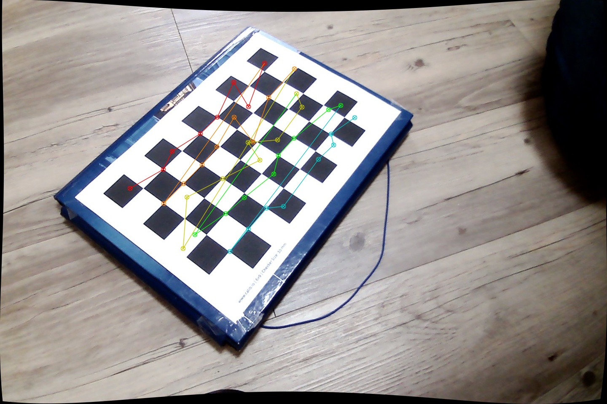
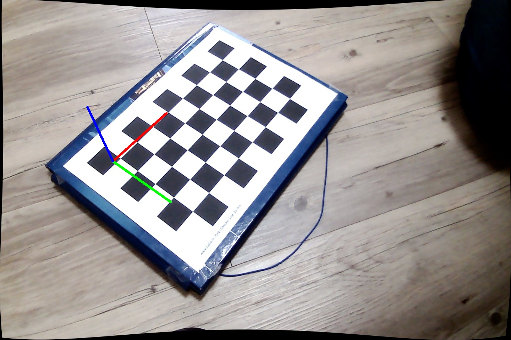

# Intro

During the lecture we have introduced the pinhole camera model.
In the real world cameras have lenses. The intuitions on
how the focal length and aperture influence the depth of field were discussed during the bonus lecture, most importantly in [this blogpost](https://ciechanow.ski/cameras-and-lenses/).

# General info

During this lab we are going to calibrate the provided cameras based on the series of images captured.

This will be the first time we will work with OpenCV locally.
It should not be too different from the Colab, but remember to call `cv2.waitKey()` after every `cv2.imshow()`.
You can install OpenCV locally with `pip`.

```bash
python3 -m venv opencv_venv
source opencv_venv/bin/activate
pip install opencv-python
python -c 'import cv2' # Check if module was found
```

# Distortions

Our camera introduce distortion to images. We will take care only of two types of distortions
during this lab:
- radial distortion and 
- tangential distortion.

Radial distortion causes straight lines to appear curved.


Tangential distortion makes a "tilted" effect. 


[This resource](https://docs.opencv.org/4.x/dc/dbb/tutorial_py_calibration.html) can be useful as a reference.

Our goal is to undistort series of images taken by a camera and have a stream with realtime undistortion.

# Dataset

We have provided a dataset of images in the `data` folder. Take a look at the first image:



[Here](calib_pattern.pdf) you can find a chessboard pattern that is used for calibration.

# Tasks

:white_check_mark: **Finding the chessboard**

Write a program, that takes a folder of pictures, finds chessboard in every picture, and either draws the chessboard or reports that it could not find one.

You will find the following functions helpful:

- [`cv2.findChessboardCorners`](https://docs.opencv.org/4.8.0/d9/d0c/group__calib3d.html#ga93efa9b0aa890de240ca32b11253dd4a) - finding chessboard corners (returns series of floats)
  - Please note that parameter `patternSize` expects number of corners between checkers, e.g. 8x5 with 9x6 checkerboard
- [`cv2.cornerSubPix`](https://docs.opencv.org/4.8.0/dd/d1a/group__imgproc__feature.html#ga354e0d7c86d0d9da75de9b9701a9a87e) -  more exact corner positions
- [`cv2.drawChessboardCorners`](https://docs.opencv.org/4.8.0/d9/d0c/group__calib3d.html#ga6a10b0bb120c4907e5eabbcd22319022) - drawing chessboard corners on the image


Function `cv2.cornerSubPix` expects five parameters:
- image, note that it is required for the image to be single channel, so conversion using `cv2.cvtColor(img, cv2.COLOR_BGR2GRAY)` is necessary,
- corners detected by `findChessboardCorners`,
- half of the side length of the search window (we suggest `(11,11)`),
- half of the size of the dead region in the middle of the search zone (we suggest `(-1, -1)` meaning no zone),
- criteria for termination of the iterative process of corner refinement (we suggest: `criteria = (cv2.TERM_CRITERIA_EPS + cv2.TERM_CRITERIA_MAX_ITER, 30, 0.001)`).

Example output:



:white_check_mark: **Camera calibration** 

Now we will expand the program to find:
- estimates of the rotation and translation vectors for each pattern view
- intrinsic parameters for the camera together with the distortion coefficients

For that purpose, we will use the function
[`cv2.calibrateCamera`](https://docs.opencv.org/4.8.0/d9/d0c/group__calib3d.html#ga3207604e4b1a1758aa66acb6ed5aa65d).
Let's have a closer look at the function parameters.

First, note that `calibrateCamera` takes `cameraMatrix` and `distCoeffs` as arguments, even though we want to find them.
If available, the function utilizes the initial values provided for these arguments during computation.
In our case, we don't have any initial guesses.
Hence, we can simply use:

```python
cameraMatrix = None, distCoeffs = None
```

Second, you have to provide an array of `objpoints` (3D) as arguments to the `calibrateCamera`.
This is actually the core part of the task.
You should write a function that will output object points when provided with the checker width and the number of corners (vertically and horizontally) on the chessboard.

For example for a 4x5 chessboard with 30mm squares the output could look like `(0,0,0), (30,0,0), (60,0,0), ....,(90,60,0)`.
In this example the unit we used for `objpoints` was millimeters.
Note that if we have 4x5 chessboard there are 3x4 intersection corners between checkers,
so with our 9x6 calibration checkerboard you should generate 8x5=40 object points.

Hints:
- `objpoints` should have type `np.float32` (the default of `np.float64` will not work).
- `np.mgrid()` is a nice numpy function you may want to use.


:white_check_mark: **Undistort images**

Now that we have our camera calibrated we can undistort the images.
Your goal now is to write a program that reads images
and shows both distorted (original) and undistorted images next to each other.

We could use
[`cv2.undistort`](https://docs.opencv.org/4.8.0/d9/d0c/group__calib3d.html#ga69f2545a8b62a6b0fc2ee060dc30559d) function to simply undistort the images.
However it is much faster to compute the undistortion and rectification transformation map using
[`cv2.initUndistortRectifyMap`](https://docs.opencv.org/4.8.0/d9/d0c/group__calib3d.html#ga7dfb72c9cf9780a347fbe3d1c47e5d5a)
and then reuse these maps multiple times with
[`cv2.remap`](https://docs.opencv.org/4.8.0/da/d54/group__imgproc__transform.html#gab75ef31ce5cdfb5c44b6da5f3b908ea4).

You can use the following values for some of the parameters of `cv2.initUndistortRectifyMap` and `cv2.remap`:

```python
R = np.eye(3), m1type=cv2.CV_32FC1, interpolation=cv2.INTER_LINEAR
```

Take a look at
`cv2.initUndistortRectifyMap()` documentation for mathematical details.
As a reminder from lab2
[`cv2.getOptimalNewCameraMatrix()`](https://docs.opencv.org/4.8.0/d9/d0c/group__calib3d.html#ga7a6c4e032c97f03ba747966e6ad862b1)
can be useful and `alpha` parameter should be chosen so that desired behaviour is achieved.
You have to decide if it is better to retain all pixels or work with a smaller field of view.


# RANSAC

Random sample consensus (RANSAC) is an iterative method which can be useful when one deals with a noisy data.
For example, when estimating a pose based on positions of features in the image.
[(According to wikipedia)](https://en.wikipedia.org/wiki/Random_sample_consensus),
RANSAC is an iterative method to estimate parameters of a mathematical model from a set of observed data that contains outliers,
when outliers are to be accorded no influence on the values of the estimates.
Let's look at an example to better understand what it actually means.

Consider an almost random 2D data:
- 5% of points come from an almost linear function,
- 95% are pure random noise

```python
import random
import matplotlib.pyplot as plt
from scipy import stats
import numpy as np

def value(alpha = 0.95):
    x = 1000 * random.random()
    y = 0.5 * x + random.gauss(0, 3) + 150
    if random.random() < alpha:
        y = random.uniform(150, 650)
    return x, y

values = [value() for _ in range(1000)]
values.sort()

x = np.array([v[0] for v in values])
y = np.array([v[1] for v in values])
res = stats.linregress(x, y) 
plt.plot(x, y, 'o', label='original data')
plt.plot(x, res.intercept + res.slope*x, 'r', label='fitted line')
plt.legend()
plt.show()
```



As you can see, the linear regression found a line that tries to fit both the data and the noise.
Obviously, this is not a good fit.
The question is, can we do better?

Let's take a look at the RANSAC algorithm:

```
Given:
    data – A set of observations.
    model – A model to explain observed data points.
    n – Minimum number of data points required to estimate model parameters.
    k – Maximum number of iterations allowed in the algorithm.
    t – Threshold value to determine data points that are fit well by model.
    
Return:
    bestFit – model parameters which best fit the data (or null if no good model is found)

iterations = 0
bestPointCount = 0

while iterations < k do
    maybeInliers := n randomly selected values from data
    maybeModel := model parameters fitted to maybeInliers
    alsoInliers := empty set
    for every point in data not in maybeInliers do
        if point fits maybeModel with an error smaller than t
             add point to alsoInliers
        end if
    end for
    if the number of elements in maybeInliers and alsoInliers is > bestPointCount then
        // This implies that we may have found a good model
        betterModel := model parameters fitted to all points in maybeInliers and alsoInliers
        bestPointCount := number of elements in maybeInliers and alsoInliers
    end if
    increment iterations
end while

return bestFit
```

We can try to use it with the following parameters:

* `k` - number of iterations set to `1000`
* `n` - number of elements in sample set to `2` (we need only two points to define a line!)
* `t` - threshold (squared distance) set to `10`

This is a result for the considered case:



As we can see the algorithm was able to deal with a dataset containing `95%` of outliers!

:white_check_mark: **RANSAC with Linear Regression**

Write your own implementation of RANSAC
and use it to find a better fit than with the standard linear regression.
Here's a general framework with TODOs to fill in:

```
best_diff = None
for k in range(100):
    sample = random.sample(values, 2)
    # TODO: perform linear regression based on the current sample
    # TODO: add datapoints to alsoInliers
    # TODO: calc how many points are in maybeInliers and alsoInliers
    # TODO: update the best model if needed
    # TODO: plot the results
```


# Pose estimation using solvePnP

Pose estimation is a task of estimating the rotations and translation vectors that transform a 3D point expressed in the object coordinate frame to the camera coordinate frame.
It uses the correspondence between the 3D point and its 2D representation in the image.
Here's more on [3D pose estimation](https://en.wikipedia.org/wiki/3D_pose_estimation).

[`cv2.solvePnP`](https://docs.opencv.org/4.8.0/d9/d0c/group__calib3d.html#ga549c2075fac14829ff4a58bc931c033d)
function is one of many OpenCV functions able to perform pose estimation
[docs](https://docs.opencv.org/4.x/d9/d0c/group__calib3d.html#ga549c2075fac14829ff4a58bc931c033d).

As parameters it takes:
* array of object points in the object coordinate space (3D)
* array of corresponding image points (2D)
* cameraMatrix estimated by `cv2.calibrateCamera`
* distCoeffs estimated by `cv2.calibrateCamera`

In fact, we have already used `cv2.solvePnP` in lab3.
It was disguised as `my_estimatePoseSingleMarkers`, but actually it was just solveP4P from four corners of a marker.
    
In the beginning of this lab we have estimated the `cameraMatrix` and `distCoeffs` of the camera.
We can find the chessboard corners on the image using `cv2.findChessboardCorners` function.
We also know our the measurements of the chessboard which will play the role of the object.

:white_check_mark: Using `cv2.solvePnP` and
[`cv2.projectPoints`](https://docs.opencv.org/4.8.0/d9/d0c/group__calib3d.html#ga1019495a2c8d1743ed5cc23fa0daff8c)
(projects 3D points to 2D image, refer to lab3)
write a program that draws 3D coordinate system with (0,0,0) at a selected corner of the chessboard.
Use the RGB convention for the axes, i.e.: X (red), Y (green) and Z (blue). See the image below:



You can use following code for drawing axes
```python
def coordinates(point):
    return [int (i) for i in tuple(point.ravel())]

def draw(img, corners, imgpts):
    # WARNING: openCV uses BGR color space
    corner = coordinates(corners[0].ravel())
    img = cv.line(img, corner, coordinates(imgpts[0]), (0,0,255), 5)
    img = cv.line(img, corner, coordinates(imgpts[1]), (0,255,0), 5)
    img = cv.line(img, corner, coordinates(imgpts[2]), (255,0,0), 5)
    return img
```

Use the images from `data` directory to test your code.

# Noisy data

Often the detected data points may be noisy.
This can lead to poor results in pose estimation like on the image below:





:white_check_mark:

1. Make the output of `cv2.findChessboardCorners` noisy by adding some artificial noise.
For example, select a few point.
Slightly disturb some of them and replace the rest with pure random noise.
2. Check (with your eyes) how `cv2.solvePnP` works on noisy data.
3. Implement an augmented version of `cv2.solvePnP` which uses RANSAC to deal with the outliers.
You can use the `cv2.solvePnP`, but the RANSAC implementation should be yours.

:white_check_mark:

Compare your results with
[`cv.solvePnPRansac`](https://docs.opencv.org/4.x/d9/d0c/group__calib3d.html#ga50620f0e26e02caa2e9adc07b5fbf24e). Check:
- accuracy (either with your own eyes or compare against original, not disturbed data)
- running speed
- try different RANSAC parameters
