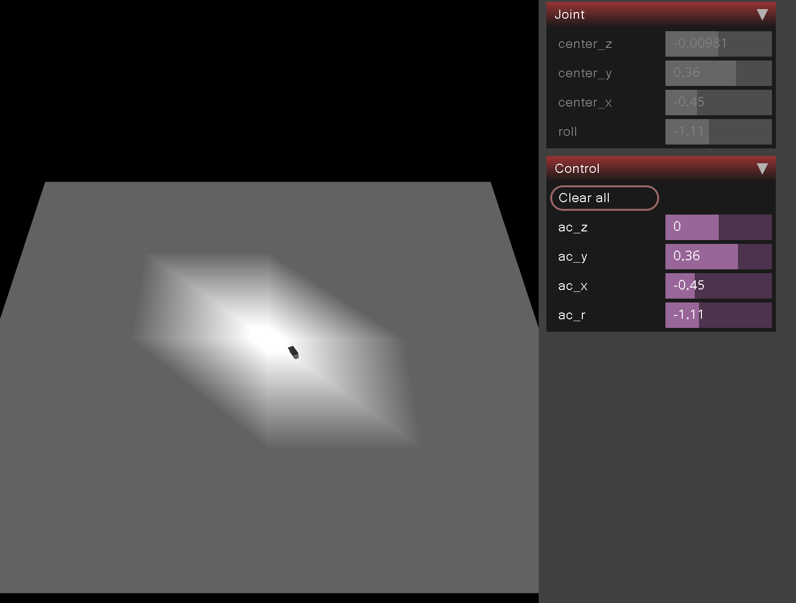
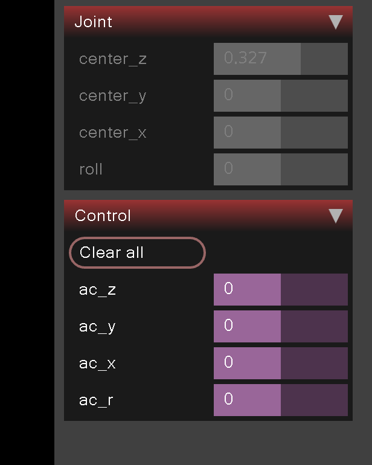

# Lab 6

## Goals

The main goals of this lab are to learn:

- a bit more about MuJoCo
- how to control a robot from python

## Steps

1. Run MuJoCo with a simple robot
2. Use the robot to move a cube
3. Control the robot using Python
4. Create a simple game in MuJoCo
5. Write a program that wins your game

### Step 1

Let's start with the following MuJoCo model:

```xml
<mujoco model="robot">
  <option timestep="0.001" gravity="0 0 -9.81"/>
  <compiler autolimits="true"/>
  <worldbody>
    <light name="top" pos="0 0 1"/>
    <body name="floor" pos="0 0 -0.1">
      <geom size="5.0 5.0 0.02" rgba="1 1 1 1" type="box"/>
    </body>
    <body name="griper">
       <inertial pos="0 0 0" mass="0.001" diaginertia="0.001 0.001 0.001"/>
      <joint name="center_z" pos="0 0 0" damping="0.5" axis="0 0 1" type="slide" range="-1.1 1.1"/>
      <joint name="center_y" pos="0 0 0" damping="0.5" axis="0 -1 0" type="slide" range="-1.1 1.1"/>
      <joint name="center_x" pos="0 0 0" damping="0.5" axis="-1 0 0" type="slide" range="-1.1 1.1"/>
      <joint name="roll" pos="0 0 0" damping="0.5" axis="0 0 1" type="hinge" range="-360 360"/>
      <geom size="0.1 0.05 0.01" type="box" rgba="0.356 0.361 0.376 1"/>
     </body>
  </worldbody>
  <actuator>
    <position name="ac_z" joint="center_z" />
    <position name="ac_y" joint="center_y" />
    <position name="ac_x" joint="center_x" />
    <position name="ac_r" joint="roll" ctrlrange="-3 3" />
  </actuator>
</mujoco>
```

If you run it with a viewer you should see an end effector attached to an (invinsible) robotic arm:



On the right you can see the controls and the position of the end effector.
Play around with the control values and see how the end effector moves.



Our actuators are `ac_z`, `ac_y`, `ac_x` and `ac_r`. They are connected to the joints `center_z`, `center_y`, `center_x` and `roll` respectively.
As you can see, we directly control the position and the angle of the end effector.

The directions of the axes in the model were not defined well.
Some direction are unnecesserily switched.
Fix the model so that it uses a more natural coordinate system.

Note:

Direct control over the position is not that common.
Very often, we control the joint velocities or acceleration (e.g. when driving a car).

To see that it's harder to control a robot through velocities or accelerations, let's change the actuator type of the `center_z` joint to `velocity`:

```xml
<velocity name="ac_z" joint="center_z">
```

When you do it, you will see that even tough the control is set to 0 the end effector is moving down until it hits the floor.
This is because the gravity is pulling the end effector down and we are not compensating for it.
Try to keep the end effector in place.
It's not that easy, right?

For now, let's go back to controlling the position directly.
We'll learn about the more advanced control techniques later on in this course.

```xml
<position name="ac_z" joint="center_z" />
```

### Step 2

Add a cube to the model:

```xml
<body name="box1" pos="0.3 0 0.5">
    <joint name="box1-joint" type="free"/>
    <geom size="0.1 0.1 0.1" rgba="1 0 0 1" type="box"/>
    <inertial pos="0 0 0" mass="0.001" diaginertia="0.001 0.001 0.001"/>
</body>
```

The cube, although much bigger than the end effector, is quite light - it's mass is only 1 gram.
Move the cube around (e.g. push it or rotate it) using the end effector.

Note: if you are having a hard time rotating the cube, try to rotate the end effector first.

### Step 3

Ok, now it's time to control the robot from python.
We will use the following code for that:

```python
import mujoco
import numpy as np
from mujoco import viewer
import time

model = mujoco.MjModel.from_xml_path("robot.xml")
data = mujoco.MjData(model)

viewer = viewer.launch_passive(model, data)

step = 0
while True:
    step_start = time.time()
    step += 1

    if step % 1000 == 0:
        data.actuator("ac_x").ctrl = np.random.uniform(-1.1, 1.1)
        data.actuator("ac_y").ctrl = np.random.uniform(-1.1, 1.1)
        data.actuator("ac_z").ctrl = np.random.uniform(-1.1, 1.1)
        data.actuator("ac_r").ctrl = np.random.uniform(-3, 3)
        print(data.joint("box1-joint").qpos)
    mujoco.mj_step(model, data)
    viewer.sync()
    time_until_next_step = model.opt.timestep - (time.time() - step_start)
    if time_until_next_step > 0:
        time.sleep(time_until_next_step)
```

Multiple things are happening in the code, so let's go through it step by step.

First we create a model and data for it.
Then we launch a viewer.
The viewer is used to display the scene in a window.
We could also create a renderer and render the scene to a file, but we will not do it in this lab.

```python
model = mujoco.MjModel.from_xml_path("robot.xml")
data = mujoco.MjData(model)
mujoco.mj_forward(model, data)

viewer = viewer.launch_passive(model, data)
```

Now the main loop starts.
We will run it forever, but you can stop it by pressing `Ctrl+C`.

Every 1000th step, we set the desired positions of the joints to random values and print the current position of the cube.
Note that the position consists of seven numbers.
The first three numbers are the position of the cube in the world coordinates.
The next four numbers are a quaternion.
Quaternions are a conscise mathematical way to describe a rotation.
We will not use quaternions directly in this lab, but you can read about them [here](https://en.wikipedia.org/wiki/Quaternion) or watch the 3blue1brown video [here](https://www.youtube.com/watch?v=zjMuIxRvygQ)

```python
data.actuator("ac_x").ctrl = np.random.uniform(-1.1, 1.1)
data.actuator("ac_y").ctrl = np.random.uniform(-1.1, 1.1)
data.actuator("ac_z").ctrl = np.random.uniform(-1.1, 1.1)
data.actuator("ac_r").ctrl = np.random.uniform(-3, 3)
print(data.joint("box1-joint").qpos)
```

In each iteration, we move the simulation forward with `mujoco.mj_step(model, data)`.
This computes the state of the system after a small period of time.
In our case, this would simply mean computing the poses of the end effector and the cube.

The last part is a small trick:

```python
time_until_next_step = model.opt.timestep - (time.time() - step_start)
if time_until_next_step > 0:
    time.sleep(time_until_next_step)
```

This simply makes sure that the frames we see in the viewer are displayed at a rate which corresponds to the physical time.
To be more precise, let's assume that we have currently displayed the state `x_t` of our system.
After calling `mj_step` we have moved the model to the next state at time `t + timestep`.
This timestep can be anything.
In MuJoCo by default it's set to `0.002` seconds.
But this does not mean that it took `0.002` seconds to compute the next state!
It actually happened much more quickly.
Hence, if we want, we can display the next frame more quickly.
For example, ten times faster:

```python
time_until_next_step = model.opt.timestep / 10 - (time.time() - step_start)
```

Note that this does not change the physical properties of our system!
We would simply display (more formally "render") the frames more quickly.

We can also change the timestep between two consequtive system states in the XML file defining our model.
In our case it's set to:

```xml
timestep="0.001" 
```

Note however, that this second type of change can actually impact the result of your simulation!
This is because you are changing how often you compute the consequtive states of your system.
Since everything we do here is just an approximation of a real system, this can change the final output.
It's very similar to choosing how small interval `dx` you want to use to approximate the area under a curve when integrating.
Using smaller `dx` gives you a more precise result, but requires more computations.
We'll talk about it in more detail later on during the course.

### Step 4

Add four cubes in random places (using `random` and modyfing the xml) within the reach of the robot.
Write a game where the goal is to get all of the cubes close to the (x=0, y=0, z=?) point.
Allow the user to control the robot with sliders.

### Step 5

Write a program which wins your game.
Try to find two different methods:

- one that moves the cubes one by one to the goal, looking at the cube's positions (qpos),
- second that always wins, no matter where the cubes are, without looking at the cube's positions,

### Step 6 (hard - optional)

Replace the cubes with balls.
Write a program which wins your game.
