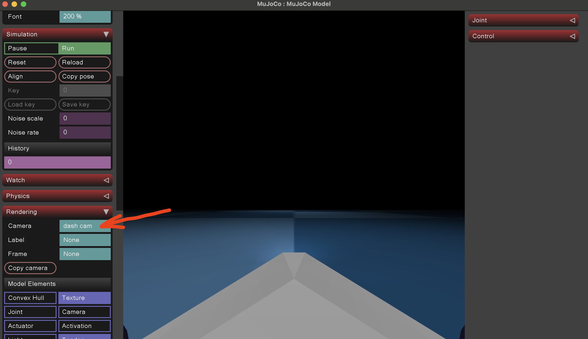
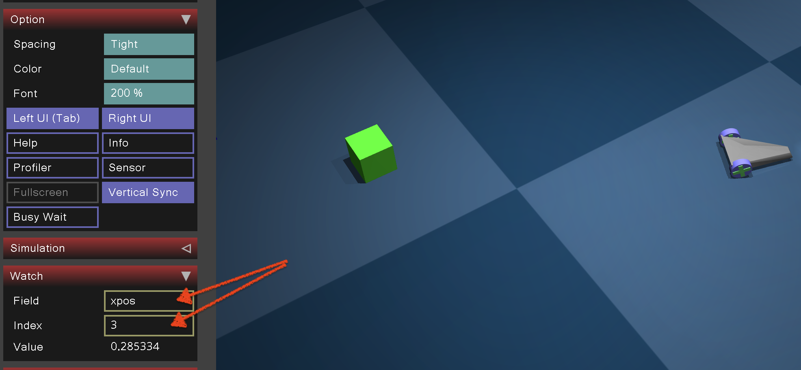
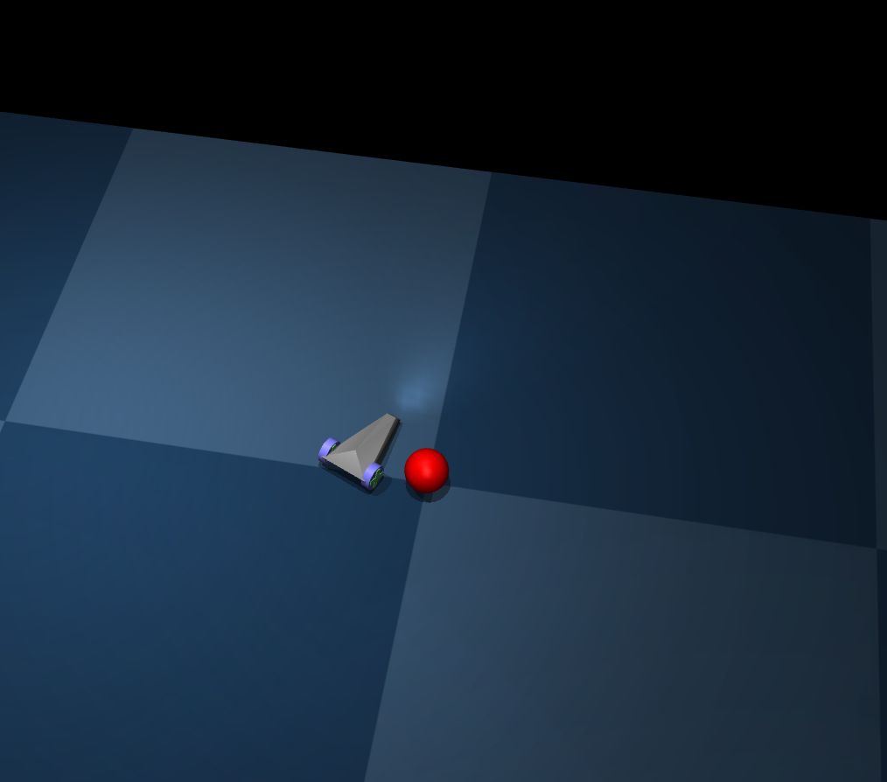
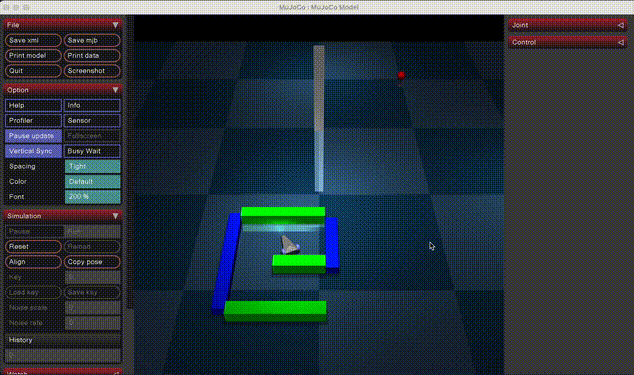
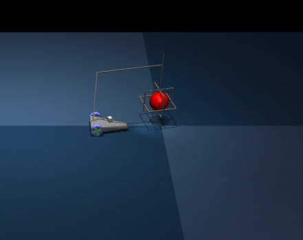

# Homework 2

## Updates

## Submission format

### Deadline: December 23, 2024 at 11:59 PM

 - Submit your work through Moodle.
 - Submit only `stub.py` file and simple instructions to recreate your virtual environment

## General Information

The assignment consists of three tasks,
each provided with a separate `car_?.xml` file describing environments with a car with a camera.

You should prepare your solution by completing the provided `stub.py` script.
You can use any Python libraries, such as `numpy` or `opencv`.

* **Task 1:** Drive the car to a red ball (3 points)
* **Task 2:** Escape a maze and drive to the red ball (6 points)
* **Task 3:** Locate, teleport, and grab the red ball using camera data (9 points)

There is a function `sim_step` that controls the car with user-specified parameters.
The `n_steps` parameter determines the number of simulation steps.
You can turn the rendering on and off with the `view` parameter.

You are not allowed to read any positions directly from the simulator in any task.
You should use only `img` that is returned by the `sim_step` function.

## Preparation

1. Read the `car_?.xml` files and `stub.py` script
2. Manual Exploration
   * Manually play with the simulator and try to perform all tasks
   * Important: Set the correct camera view
    
3. Coordinate Tracking
   * Check coordinates of the car and the ball using one of these methods:
       * Print `data.body("car").xpos` and `data.body("ball").xpos` in the console
       * Examine `xpos` values directly in the simulator
       

### Viewing images

It's hard to display images using both MuJoCo and OpenCV.
You can try to use `PIL` library to display images, because it spawns a new process for each image.

## Task 1

Your goal in this task is to drive the car to a red ball without touching it.
At the end, your car should be close to the ball (0.2 distance is fine).
Example result:



For the car control, you can use only the `sim_step` function.

The car and the ball are always at the same position.
However, the orientation of the car is randomly selected at the beginning of the evaluation:

```python
steps = random.randint(0, 2000)
controls = {"forward": 0, "turn": 0.1}
img = sim_step(steps, view=False, **controls)
```

Your solution should therefore work regardless of the initial orientation of the car.

Change only the code beteween `TODO` and `/TODO` marks (do not remove them).

## Task 2

### Task 2: Maze Escape

The second task is similar to the first one,
but the red ball is not visible from the starting position.
This is because you start inside a simple maze.
Hence your goal is to navigate the car out of the maze and,
once you've escaped, drive to the destination point.

Your car is in the random position when you gain control:

```python
speed = random.uniform(-0.3, 0.3)
turn = random.uniform(-0.2, 0.2)
controls = {"forward": speed, "turn": turn}
img = sim_step(1000, view=True, **controls)
```

For car control, you can use only `sim_step` function.

Your solution should work efficiently.
So it's not acceptable to have a solution which performs random movements to exit the maze.
We do not want to set specific bounds on the computation time,
but it should work reasonably well with normal rendering speeds.

Sample successful run can be seen below:



Change only the code beteween `TODO` and `/TODO` marks (do not remove them).

## Task 3

In the third task you are supposed to grab a red ball using a gripper attached to the car.
The world is static and you know the position of the ball.
However at the begining car will be placed in a random position.


You are provided with a few additional resources:
 - `teleport_by` function which allows you to "teleport" the car by a given delta position on the plane
 - `get_dash_camera_intrinsics` function which allows you to extract intrinsic camera parameters of the dash camera.
 - a cube with ArUco markers which you should use to determine a precise position of the car
 - a gripper and additional controls to control it.
 Play around manually with the simulation environment to understand how the controls work.
 - two functions to help you assert if the ball is sufficiently closed (`ball_close`) and if the ball was correclty grabbed (`ball_grab`)

A successful grasp is illustrated in the image provided.



For car and gripper control, you can use only `sim_step` function.
Remember that you are supposed to use only the information from the dash camera.

Change only the code beteween `TODO` and `/TODO` marks (do not remove them).

## Summary and Implementation Details

* Write your code in the provided `stub.py` file.
* You're free to use any Python libraries you find helpful.
* We recommend leveraging the `numpy` library for numerical computations and the `opencv` library for image processing.
